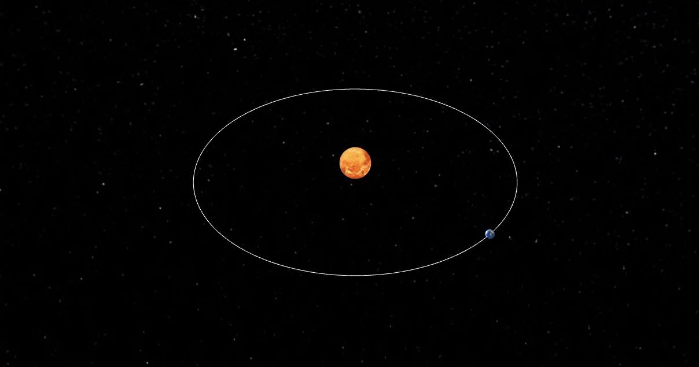

# 3D Orbit Simulation

**Website:** [chidiwilliams.github.io/3d-orbit-simulation](https://chidiwilliams.github.io/3d-orbit-simulation/)

A 3D simulation of the Earth orbiting the Sun using [Three.js](https://threejs.org/).

This project uses the physics and math equations from [Evgenii's simulation](https://evgenii.com/files/2016/09/earth_orbit_simulation/the_complete_code/). Please refer to the [Evgenii's blog post](https://evgenii.com/blog/earth-orbit-simulation/) for more information how the equations are derived.

## Improvements

- [ ] Add camera views for arbitrary points on the sun and earth to visualize the movement of the other body
